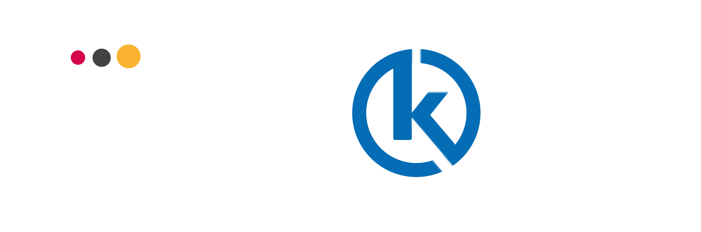

# Badakar Revamped

A revamped version of the Badakar website for an interior designer, built with Vite and React.

**Live Demo:** [https://ha51b-badakar.netlify.app](https://ha51b-badakar.netlify.app)

## Technologies Used

- **Vite**: Fast frontend build tool
- **React**: JavaScript library for building user interfaces

## TODO

### Future Improvements

- **Complete Remaining Pages**
  - Finish the pages that are currently marked as 'Under Construction'.
  
- **Add Emailing Service**
  - Integrate an emailing service so that contact form submissions trigger an email to the concerned person.
  
- **Work Gallery**
  - Create a gallery featuring the best works, including images and videos, to showcase the site's portfolio.
  
- **Integrate Promo Video**
  - If a promotional video exists, incorporate it to better highlight the site's offerings.
